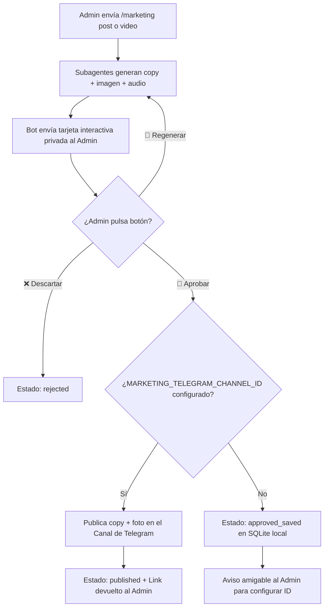

# Guía de Operaciones Fase 0: Canal Vitrina Telegram & Marketing Studio

> **Objetivo:** Establecer una vitrina de producto ágil (*Build in Public* y demos de alta conversión) para alcanzar los primeros 50 usuarios reales sin dispersar a la audiencia ni generar el efecto "pueblo fantasma".

---

## 1. Filosofía de Fase 0 (0 a 50 usuarios)

1. **Un solo canal unidireccional (Broadcast):**
   - El público general **solo lee** las novedades, casos de uso y vídeos de demostración.
   - No hay hilos vacíos ni silencios incómodos.
   - El soporte y feedback se canaliza **1 a 1 por privado** con el fundador/administrador.
2. **Producción Primero (Scopes Verificables):**
   - Los usuarios de acceso anticipado conectan sus cuentas a través del flujo oficial seguro `/auth` (scopes de producción de Google Workspace en revisión).
   - **Prohibido promocionar o vender "beta con scopes amplios"**; la beta está restringida exclusivamente a la lista blanca de administradores (`BETA_USER_IDS`).
3. **Destino de Marketing Studio:**
   - Tu subagente de marketing genera propuestas (`/marketing post`, `/marketing video`, `/marketing short`).
   - Tras tu aprobación explícita mediante el botón interactivo de Telegram, el contenido se publica automáticamente en este canal si está configurado el ID del canal.

---

## 2. Paso a Paso: Creación del Canal en Telegram

### Paso 1: Crear el Canal
1. Abre Telegram en tu móvil o escritorio.
2. Pulsa en el icono de **Nuevo Mensaje** (lápiz) y selecciona **Nuevo Canal** (NO nuevo grupo ni supergrupo).
3. Asigna un nombre claro y profesional, por ejemplo:
   - `Silvania AI | Demos & Updates`
   - O `Silvania CoreAgent | Novedades`
4. Descripción recomendada:
   ```text
   Canal oficial de Silvania.ai. Descubre casos de uso reales, demostraciones en vídeo y novedades de Silvania CoreAgent (asistente de Google Workspace en Telegram).
   Web: https://silvania.ai
   Bot: @Silvania_Core_Agent_Bot
   ```
5. Tipo de canal: **Público** (asigna un enlace permanente como `t.me/silvania_ai` o el handle que prefieras).

### Paso 2: Añadir el Bot como Administrador
1. Entra en los ajustes del canal recién creado → **Administradores** → **Añadir Administrador**.
2. Busca el usuario de tu bot (ej. `@Silvania_Core_Agent_Bot`).
3. Asígnale permiso de:
   - ✅ **Publicar mensajes** (Post messages)
   - ✅ **Editar mensajes** (Edit messages)
4. Guarda los cambios.

### Paso 3: Obtener el `MARKETING_TELEGRAM_CHANNEL_ID`
Los canales de Telegram tienen un identificador numérico único que comienza por `-100`. Existen dos métodos sencillos para obtenerlo:

#### Método A (Reenviando a un bot de utilidades)
1. Escribe cualquier mensaje de prueba en tu canal.
2. Reenvía ese mensaje a `@userinfobot` o `@RawDataBot`.
3. El bot te responderá con los metadatos del mensaje; busca el campo `"forward_from_chat"` o `"id"`. Verás un número con formato: `-100xxxxxxxxxx`.

#### Método B (Vía web browser)
1. Abre Telegram Web (`web.telegram.org/a/` o `web.telegram.org/k/`).
2. Entra a tu canal y observa la URL del navegador:
   - Si la URL es `web.telegram.org/k/#-1002158943210`, el ID es `-1002158943210`.

---

## 3. Variables de Entorno en Railway

Una vez creado el canal y obtenido su ID, añade o actualiza las siguientes variables en el panel de **Railway** (servicio `silvaniacoreagent`):

| Variable | Valor de Ejemplo | Descripción |
| :--- | :--- | :--- |
| `MARKETING_TELEGRAM_CHANNEL_ID` | `-1002158943210` | ID numérico del canal para la publicación automática. Si se deja vacío, el sistema guarda los borradores aprobados en SQLite sin dar error. |
| `MARKETING_TELEGRAM_CHANNEL_URL` | `https://t.me/silvania_ai` | URL pública del canal para que el bot la recomiende en `/start` y en `/canal`. |
| `MARKETING_ADMIN_IDS` | `1572946817` | IDs de Telegram autorizados para generar, revisar y aprobar contenido. |

---

## 4. Flujo Operativo de Aprobación y Publicación (HITL)



---

## 5. Qué NO Hacer en Fase 0 (Antipatrones Críticos)

* ❌ **NO abrir un Supergrupo con Topics:** Si entran 10 personas a un grupo con 5 topics, el 90% de los hilos estarán vacíos, transmitiendo sensación de abandono.
* ❌ **NO dispersar en múltiples canales:** No abras un canal para CoreAgent, otro para Eva y otro para Silvania. Un único canal vitrina concentra todo el impacto.
* ❌ **NO vender ni promocionar "Beta con permisos amplios":** La propuesta de valor de Silvania se basa en la confianza, seguridad y verificación de Google. Solo promociona las capacidades legítimas de producción.
* ❌ **NO publicar borradores automáticos sin revisión:** Mantén siempre el bucle *Human-in-the-Loop*; tú eres el editor final de lo que sale al público.

---

## 6. Tres Ideas de Demos de 30 Segundos para el Canal

Graba la pantalla de tu móvil o escritorio interactuando con Silvania en Telegram. Estas 3 demos demuestran valor inmediato:

### Demo 1: "Factura a Sheets en 15 segundos"
* **Acción:** Envías un audio o mensaje rápido: *"Apunta una factura de 450€ de diseño web para Acme Corp con fecha de hoy"*.
* **Respuesta del bot:** Silvania añade la fila en Google Sheets con fórmulas automáticas y te devuelve el enlace directo a la hoja.
* **Gancho del post:** *"¿Cuánto tardas en abrir Excel o Sheets cada vez que facturas? Así lo hace Silvania CoreAgent desde Telegram por voz."*

### Demo 2: "Investigación Web Real sin Humo"
* **Acción:** Pides: *"Investiga el sitio web de [empresa o cliente] y dime a qué se dedican y qué servicios ofrecen"*.
* **Respuesta del bot:** Silvania entra con `read_url` en tiempo real, extrae los servicios verificados y separa los datos comprobados de lo no encontrado.
* **Gancho del post:** *"Cero alucinaciones. Investigación ejecutiva real antes de entrar a tu reunión comercial."*

### Demo 3: "Tu agenda del día al subirte al coche"
* **Acción:** Mandas nota de voz: *"¿Qué tengo programado para hoy en el calendario?"*.
* **Respuesta del bot:** Silvania lee los eventos de Google Calendar y te responde con una nota de voz clara y estructurada.
* **Gancho del post:** *"Manos libres de verdad. Tu asistente ejecutivo te canta la jornada antes de salir del parking."*
